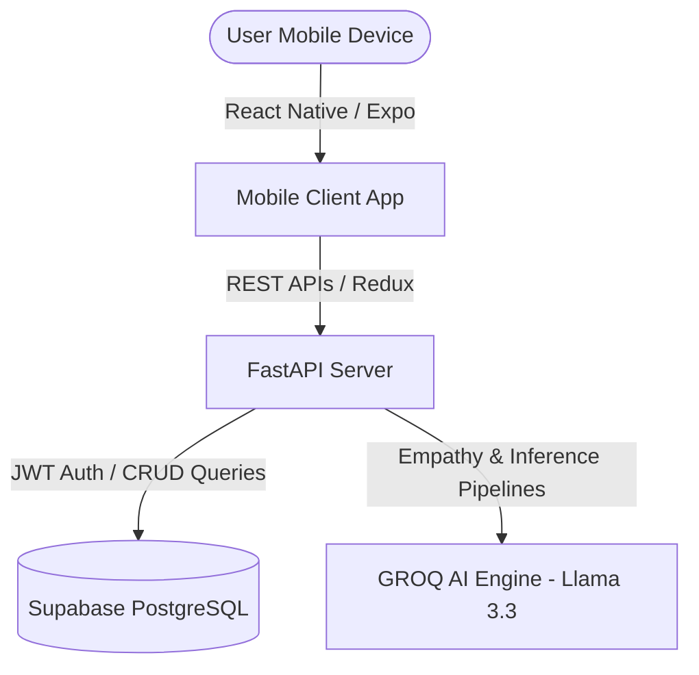
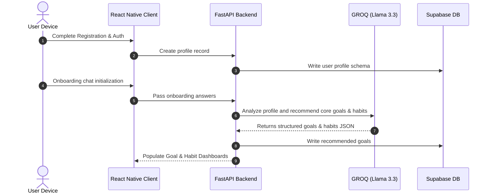

# 🌌 Evana — AI Life Coach App

Evana is a premium, conversation-first AI-powered life coaching mobile application designed to empower users to achieve personal growth, goal accountability, structured habit-building, and thoughtful daily self-reflection. 

Unlike traditional static productivity apps, **Evana prioritizes natural language dialogue.** By interacting with a personalized AI life coach, users define their vision, log habits, evaluate mood baselines, and receive dynamic coaching feedback seamlessly.

---

## 📖 Table of Contents
1. [Project Overview & Objectives](#-project-overview--objectives)
2. [Target Users](#-target-users)
3. [Architecture & Technology Stack](#-architecture--technology-stack)
4. [Core Features Deep Dive](#-core-features-deep-dive)
5. [User Journey & High-Level Workflow](#-user-journey--high-level-workflow)
6. [Future AI Agent Architecture](#-future-ai-agent-architecture)
7. [System Requirements](#-system-requirements)
8. [Installation & Setup Guide](#-installation--setup-guide)
9. [Premium Stability & Pixel-Perfect Fixes](#-premium-stability--pixel-perfect-fixes)

---

## 🎯 Project Overview & Objectives

Evana provides the structure of a professional life coach through a high-frequency, low-latency, empathetic AI agent experience. 

### Primary Objectives:
*   **Conversation-First Design:** Establish a direct, empathetic chat flow for personal guidance and daily accountability.
*   **Smarter Goal Setting:** Formulate short and long-term milestones with automatic progress calculations.
*   **Habit Reinforcement:** Seamlessly schedule habits linked directly to overarching life goals.
*   **Guided Reflections:** Create interactive, prompt-based daily journals analyzed for mood pattern baseline shifts.
*   **Scalable Architecture:** Build a modular FastAPI and Supabase backend ready for multi-agent autonomous framework integrations.

---

## 👥 Target Users

*   **Self-Improvement Enthusiasts:** Individuals seeking guided frameworks for emotional and professional growth.
*   **Productivity Professionals:** Goal-oriented individuals looking for structured habit logs and cognitive baselines.
*   **Accountability Seekers:** Users wanting real-time reminders, AI-driven milestones, and dynamic push notifications.
*   **Journaling Fans:** People who want to convert stream-of-consciousness writing into actionable data insights.

---

## 🏗️ Architecture & Technology Stack

Evana is engineered with a modular, highly scalable split-stack topology that isolates AI inference pipelines from client-side state management.



### 📱 Frontend (React Native & Expo)
*   **Framework:** React Native managed inside the **Expo Framework** for rapid, cross-platform stability.
*   **State Management:** **Redux Toolkit** managing asynchronous thunks (Auth, Goals, Habits, Analytics, Reflections).
*   **UI/UX Design System:** Custom theme engine employing glassmorphism aesthetics, `Expo Linear Gradient` background canvases, and smooth `Lucide Icons`.

### ⚡ Backend (FastAPI & Python 3.12+)
*   **Core Framework:** **FastAPI** with `Uvicorn ASGI` server, optimized for asynchronous, low-latency client requests.
*   **Data Validation:** **Pydantic v2** validation schemas ensuring compile-time type-safety across requests.
*   **Environment Manager:** **Astral UV** package manager for supercharged environment builds and exact package lock resolutions.

### 🗄️ Database & Security (Supabase)
*   **Storage & DB:** **Supabase PostgreSQL** holding structured data models (User Profiles, Goals, Habits, Logs, Reflections, Conversations).
*   **Session Management:** JWT-based user authentication integrated via Supabase Auth services.

### 🤖 AI Pipeline (GROQ Cloud)
*   **LLM Model:** **Llama-3.3-70b-versatile** model mapped through the high-speed **GROQ API** for sub-3-second conversational coaching response times, goal calculations, and automatic journal sentiment scoring.

---

## ⚡ Core Features Deep Dive

### 1. 💬 AI Conversational Coach
An interactive coaching console that processes natural language user inputs, understands intention patterns, and converts them into structured actions.
*   *empacted dialogues* using Groq API.
*   *WhatsApp-style Layout:* Message lines stay perfectly structured above the keyboard using strict viewport containment rules.
*   *Android Typing Safety:* Auto-scroll to end actions are wrapped in 120ms layout delays to ensure the input field never hides or cuts off active chat logs.

### 2. 🎯 Goal Management System
A visual, category-based goal tracker that measures user strides across multiple dimensions of life (Fitness, Career, Finance, Learning, Personal development).
*   **Custom Goal Attributes:** Description, Target date, Category, Progress percentage, Status (active, completed, paused).
*   **Real-time Milestones:** Automatic notifications sent via push whenever progress passes **25%, 50%, 75%, or 100%** completion.

### 3. 📅 Habit Tracking System
Allows users to create, schedule, and mark daily habits that are linked to overarching goals.
*   High-efficiency streak calculations stored in Supabase profiles.
*   Daily compliance charts tracking weekly frequency grids.

### 4. 📝 Reflection Journaling & Sentiment Analysis
Prompt-guided prompts ("What went well?", "What challenges did you face?") designed to build self-awareness.
*   Automatic sentiment scoring mapping inputs to a 5-point mood baseline (from 🤩 down to 😤).
*   AI-generated journal summarizations that digest paragraphs of thought into high-level coaching tags.

### 📊 Analytics Dashboard
Provides week-and-month charts displaying:
*   Dynamic goal progress tracks.
*   Habit consistency columns based on log percentages.
*   Mood baselines mapping emotional changes across 7 to 30 days.
*   AI Weekly Growth Narratives translating raw telemetry into actionable self-care summaries.

---

## 🔄 User Journey & High-Level Workflow



---

## 🤖 Future AI Agent Architecture

The backend framework is designed to seamlessly adopt orchestrator frameworks like **CrewAI** and **Microsoft AutoGen** to delegate lifestyle modules to specialized sub-agents:

*   **Goal Planning Agent:** Decomposes long-term goals into multi-week sub-tasks.
*   **Habit Optimization Agent:** Analyzes habit logs to suggest schedules that match circadian energy peaks.
*   **Reflection Analysis Agent:** Compares multi-week reflections to alert the user of unrecognized burnout signals.
*   **Productivity Coach Agent:** Suggests focused focus blocks when goal compliance drops below 60%.

---

## 💻 Installation & Setup Guide

### 1. Backend Server Setup

#### Prerequisites:
*   Python 3.12+
*   FastAPI & Uvicorn
*   Astral `uv` installed (`pip install uv`)

#### Steps:
1.  **Navigate to backend directory:**
    ```bash
    cd backend
    ```
2.  **Create and activate your Python virtual environment:**
    ```bash
    python -m venv venv
    source venv/bin/activate  # On Windows use: venv\Scripts\activate
    ```
3.  **Install dependencies using UV:**
    ```bash
    uv pip install fastapi uvicorn supabase groq python-dotenv pydantic
    ```
4.  **Configure Environment Variables (`backend/.env`):**
    ```env
    SUPABASE_URL=https://your-project-id.supabase.co
    SUPABASE_SERVICE_ROLE_KEY=your-supabase-service-role-key
    GROQ_API_KEY=gsk_your_groq_api_credential_key
    ```
5.  **Run Development Server:**
    ```bash
    uv run python main.py
    ```
    The API runs natively at `http://127.0.0.1:8000`.

---

### 2. Mobile App Client Setup

#### Prerequisites:
*   Node.js (v18+)
*   Expo Go app on iOS or Android

#### Steps:
1.  **Navigate to app directory:**
    ```bash
    cd evana-app
    ```
2.  **Install node packages:**
    ```bash
    npm install
    ```
3.  **Configure Host Endpoint:**
    Open `src/constants/config.ts` and update `BASE_URL` with your local development machine's local IP address (e.g., `http://192.168.1.XX:8000`) so your physical mobile device can connect to the local API.
4.  **Start Expo Server:**
    ```bash
    npm start
    ```
5.  Open **Expo Go** on your physical phone, scan the terminal's QR code, and experience Evana live!

---

## 🎨 Premium Stability & Pixel-Perfect Fixes

Our development cycles target absolute structural fidelity across real-world environments.
*   **Unified Card Geometry:** Fixed feature grid misalignments by giving small right-side widgets (`smallCard` - Goals/Reflections) dynamic `flex: 1` values inside matching columns, setting border-radii to a premium `24` to match hero cards.
*   **Chat View Integrity:** Removed absolute floats on message input boxes, binding flatlists to strict viewport containers so active chats never stick or slide behind input controls.
*   **Correct Goals Calculations:** Fixed database schema mismatches where analytics was querying the non-existent `progress_percentage` and updates were looking for `current_progress`. Mapped both levels directly to the unified **`progress`** column for seamless check-in synchronization!

---

## 📄 Project Registry
Created by **hamzaahmad3006** (hamzaahmad3006@gmail.com). All rights reserved.
